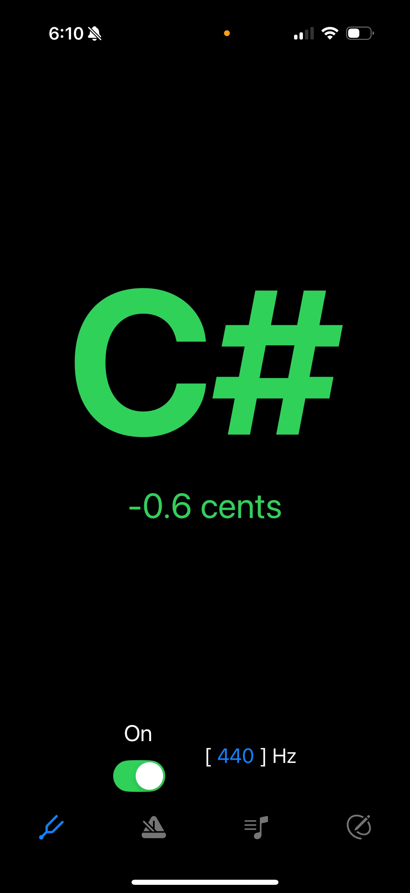
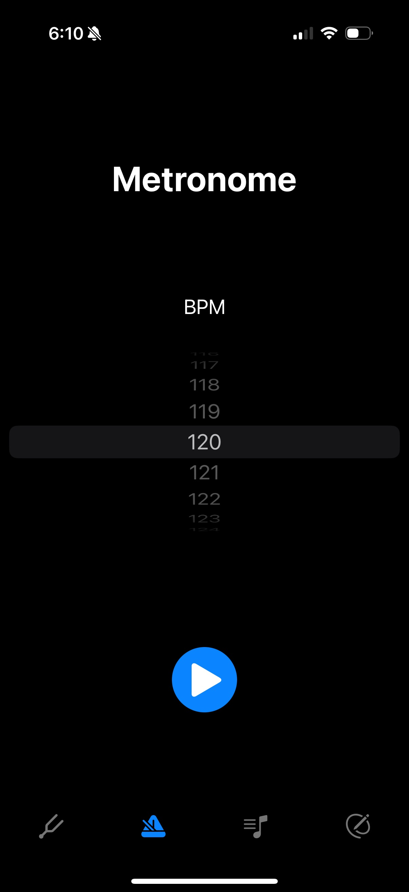
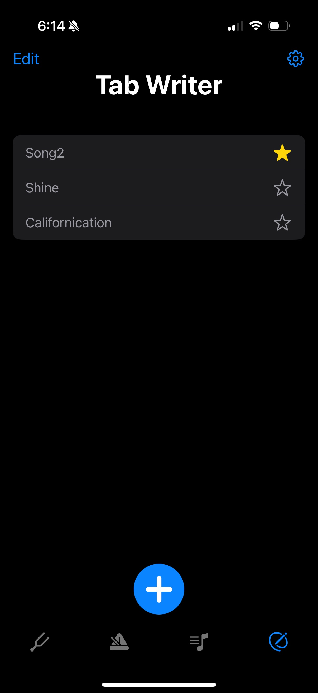
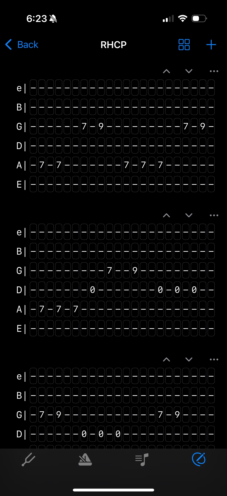
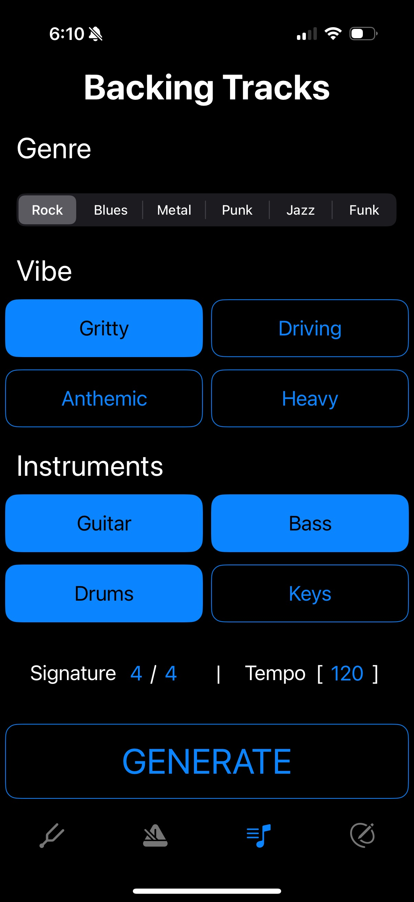

# GuitarIt

An open-source iOS guitar companion built entirely in Swift. GuitarIt combines real-time audio processing, on-device machine learning, and music theory to give guitarists a tuner, metronome, and tab editor in one place — with automatic tab transcription on the way.

> **Status: active development.** The core tools work. The ML-powered tab recognition pipeline is built and partially wired; the final chord-to-tab mapping step is the current focus.

---

## What works today

### Tuner



Real-time chromatic tuner powered by CREPE, a deep-learning pitch estimator originally trained by NYU's Music and Audio Research Lab. The Python model was converted to Core ML so inference runs entirely on-device.

The audio pipeline captures at 48 kHz, downsamples to 16 kHz (CREPE's expected rate), and feeds 1024-sample frames into the model. CREPE returns a 360-bin activation vector; the app computes a weighted local average in cents-space and converts to Hz — the same math as the reference Python library. Confidence-weighted exponential smoothing reduces jitter before the note and cents-offset are shown. Color feedback (green / yellow / red) updates in real time.

Supports non-standard tuning references (A ≠ 440 Hz).

### Metronome



Tap-to-start metronome with adjustable BPM. Uses a `DispatchSourceTimer` on a high-priority queue for precise, drift-resistant timing.

### Tab Editor

 

A grid-based ASCII tab editor. Tabs are stored as plain text files and round-trip cleanly between the editor and the file system. iCloud Drive sync is supported alongside local storage; the app handles orphaned files and metadata consistency automatically.

Features: multiple tab templates, per-tab naming and favorites, sort modes (favorites-first, last-used, by-date), duplicate/delete/reorder of tab sections.

---

## What's in progress

### Real-time tab transcription
This is the ambitious piece. The goal: play your guitar and have the tab write itself.

The pipeline is built end-to-end:

1. **Audio capture** — a shared `AudioCaptureService` lets multiple consumers subscribe to the same microphone stream without redundant engine instances.
2. **Single-note detection** — CREPE (same model as the tuner) identifies individual notes with timestamps.
3. **Polyphonic / chord detection** — Spotify's BasicPitch model (also converted to Core ML) runs on overlapping windows of audio resampled to 22 050 Hz. A full Swift port of BasicPitch's post-processing logic (`BasicPitchPostProcessor`) decodes the model's frame, onset, and contour outputs into timestamped MIDI note events, including the Melodia trick for recovering notes missed by onset detection.
4. **Chord clustering** — note events from BasicPitch are grouped into chords using a 50 ms onset-proximity threshold.
5. **Voicing matching** — a library of ~30 movable and open guitar voicing templates (E-shape, A-shape, power chords, triads across all string groups, open C/D/G families) is in place for mapping detected chords to string/fret positions.
6. **Tab insertion** — the final step: writing matched events into the grid. The overlap-rejection logic and tab locking are implemented; the chord→voicing lookup and single-note string/fret assignment are the remaining stubs.

The current work is completing step 6: resolving detected pitches and chord clusters to the best string/fret positions and inserting them into the tab grid.

### Backing track generator



The UI is complete: genre selection (Rock, Blues, Metal, Punk, Jazz, Funk), vibe sub-options per genre, instrument picker, tempo and time-signature fields. The generation backend is a placeholder — the original plan used Google's Lyria generative audio model, which was deprecated before integration. Alternatives are being evaluated.

---

## Technical notes

- **ML models on-device**: both CREPE (small variant) and BasicPitch (Spotify's `nmp` model) are bundled as `.mlpackage` files and run via Core ML. No server round-trip, no API key.
- **Audio architecture**: `AudioCaptureService` is a singleton with a listener-map pattern. Features that need the microphone (tuner, tab transcription) register independently; the engine starts and stops based on active consumer count.
- **Tab storage**: tabs are plain UTF-8 text files with a simple ASCII grid format. Metadata (name, template, favorite status, timestamps) is kept in `UserDefaults` as JSON. The app reconciles the two on launch and prunes orphaned files.
- **Swift only**: no third-party dependencies. Core ML, AVFoundation, SwiftUI, Combine, CoreData.

---

## Project structure

```
GuitarIt/
├── AudioCapture/        # Shared audio engine, CREPE processor, BasicPitch processor + post-processor
├── Tuner/               # Tuner view + view model
├── Metronome/           # Metronome view + view model
├── Tabs/
│   ├── TabWriter/       # Tab list / file management
│   ├── TabEditor/       # Grid editor, toolbar, formatting
│   ├── TabCompleter/    # Voicing library, string/fret mapper, tab events
│   └── TabWriterSettings/
├── BackingTrackGenerator/
├── CREPE_SMALL.mlpackage
└── nmp.mlpackage        # BasicPitch
```

---

## Third-party attributions

Third-party licenses are collected in [`THIRD_PARTY_LICENSES`](THIRD_PARTY_LICENSES).

- **CREPE** — pitch estimation model by NYU's Music and Audio Research Lab. MIT License. Source and attribution in `AudioCapture/Crepe.swift`.
- **BasicPitch** — polyphonic pitch detection model by Spotify AB. Apache 2.0. Source and attribution in `AudioCapture/BasicPitch.swift`.
- **click.wav** — metronome click sound by Druminfected ([freesound.org/s/250552](https://freesound.org/s/250552/)). Creative Commons 0.
